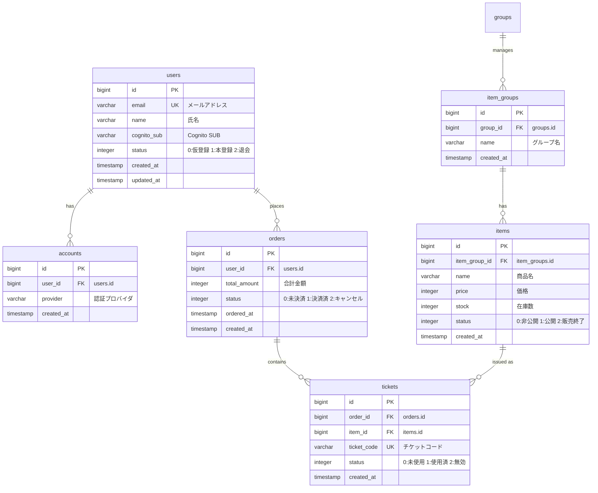

# Mermaid ER図フォーマット

## 基本構文

Mermaid の erDiagram を使用する。

## 出力テンプレート



## カーディナリティ表記

| 記法 | 意味 |
|------|------|
| `\|\|--\|\|` | 1対1 |
| `\|\|--o{` | 1対多 |
| `o{--o{` | 多対多（中間テーブル経由） |
| `\|\|--o\|` | 1対0..1 |

## カラム表記ルール

各カラムの記法:
```
データ型 カラム名 [制約] ["コメント"]
```

制約:
- `PK` — PRIMARY KEY
- `FK` — FOREIGN KEY（コメントに参照先を記載）
- `UK` — UNIQUE KEY

コメント:
- ENUM値やステータスの意味を記載: `"0:未使用 1:使用済 2:無効"`
- 参照先テーブル: `"users.id"`
- ビジネス上の説明（簡潔に）

## 共通カラムの扱い

`created_at`, `updated_at`, `deleted_at` は以下の基準で制御する:

- デフォルト: 含める（実際のスキーマに忠実）
- ユーザーが「簡潔にして」と指示した場合: 省略し、図の末尾に注記を追加:
  ```
  %% 注: 全テーブルに created_at, updated_at カラムが存在（図では省略）
  ```

## 分割出力時の構成

テーブル数が多い場合:

1. **全体概要図** (`er-overview.md`): テーブル名とリレーションのみ（カラム省略）
2. **ドメイン別詳細図** (`er-{domain}.md`): カラム含む完全な定義

全体概要図の例（Markdownファイルとして出力）:

ファイル先頭に `# ER図 {タイトル}` を付け、Mermaid図を ` ```mermaid ` コードブロックで包む。

## 出力ファイル

ファイルは `{backend_dir}/{er_dir}/` ディレクトリに `.md` 形式で配置する。
Mermaid図は必ずMarkdownの ` ```mermaid ` コードブロック内に記述する。

- 単一図: `{backend_dir}/{er_dir}/er-diagram.md`
- 分割時:
  - `{backend_dir}/{er_dir}/er-overview.md`（全体概要）
  - `{backend_dir}/{er_dir}/er-{domain}.md`（ドメイン別）

### ファイル構成テンプレート

```
# ER図 {タイトル}

```mermaid
erDiagram
    ...
```
```
