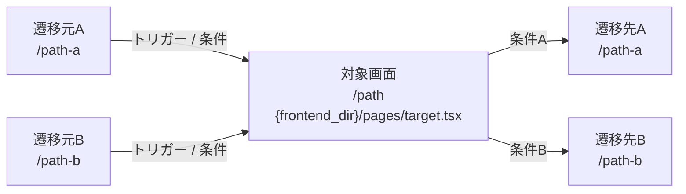

# フロントエンド画面機能仕様書テンプレート

> このテンプレートはExcel基本設計書（B4.画面機能仕様書）への変換を前提としています。
> セクション構成はExcelのセクション構成と1:1で対応しています。

ドキュメント冒頭に以下の注記を必ず記載する:

```
> **注記**: 本ドキュメント内のファイルパス・行番号は YYYY-MM-DD 時点のソースコードに基づきます。
> コード変更により行番号がずれる可能性があります。
```

---

## Excelセクション対応表

| Excel セクション | マークダウン セクション | 備考 |
|-----------------|----------------------|------|
| 共通情報 | §1 基本情報 | プロジェクト名等はExcel側で固定値として埋める |
| 書誌情報 | §1 基本情報 | 画面ID・画面名・概要 |
| 画面遷移図 | §6 画面遷移 | Mermaid図をExcelには画像として貼付 |
| 画面レイアウト | （対象外） | スクリーンショット等で別途補完 |
| 操作権限 | §2 操作権限 | ユーザ種別ごとのアクセス可否 |
| 前提条件 | §3 前提条件 | 表示対象データの条件等 |
| イベント一覧 | §4 イベント一覧 | 識別ID / イベント名 / 処理概要 |
| イベント処理詳細 | §5 イベント処理詳細 | イベントIDごとの処理ロジック |

---

## 画面機能仕様書テンプレート

```markdown
---
tags:
  - screen-design
  - frontend  (または frontend-admin / frontend-partners)
  - [screen-name]  (画面名をケバブケースで記載。例: cart, purchase-menu)
source: {frontend_dir}/pages/[screen]/index.tsx
updated: YYYY-MM-DD
---

# 画面機能仕様書 - [画面名]

> **注記**: 本ドキュメント内のファイルパス・行番号は YYYY-MM-DD 時点のソースコードに基づきます。
> コード変更により行番号がずれる可能性があります。

## 1. 基本情報

| 項目 | 内容 |
|------|------|
| 画面名 | [日本語の画面名] |
| 画面ID | [{screen_id_prefix}-xxx（わかる場合）または「要採番」] |
| パス | [URLパス] |
| 概要 | [この画面の概要（1〜2文）] |
| ページコンポーネント | `{frontend_dir}/pages/xxx.tsx:行番号` |
| 認証 | [必須 (AuthGuard) / 不要] |
| レイアウト | [使用レイアウトコンポーネント] |
| SSR/SSG | [getServerSideProps / getStaticProps / CSRのみ] |

---

## 2. 操作権限

| ユーザ | ユーザの認証状態・権限 | 動作 |
|--------|----------------------|------|
| [ユーザ種別] | [未ログイン] | [「ログイン」画面へ遷移] |
| | [ログイン済み] | [画面が表示される] |
| | [直アクセス時の認証後戻り先] | [画面が表示される] |

操作権限が特にない場合（認証不要の公開ページ等）は「認証不要。全ユーザがアクセス可能。」と記載。

---

## 3. 前提条件

この画面を表示するための前提条件を箇条書きで記載する。

- [表示対象データの条件]
- [localStorage / sessionStorage から取得する前提データ]
- [他画面から受け渡されるデータ]
- [ビジネスルール上の前提]

前提条件がない場合は「なし」と記載。

---

## 4. イベント一覧

| 識別ID | イベント名 | 処理概要 |
|--------|-----------|---------|
| 1 | 初期表示 | [画面表示時の情報・状態により初期表示を行う] |
| 2 | [ボタン名/操作名] | [処理の概要を1文で] |
| 3 | [ボタン名/操作名] | [処理の概要を1文で] |
| ... | ... | ... |

**採番ルール**:
- #1 は必ず「初期表示」
- #2 以降はJSXの上から順にUI要素を走査し、出現順に採番
- モーダル内の操作は、モーダルを開くイベントの後に連続して採番

---

## 5. イベント処理詳細

> **記述スタイル**: 処理内容は人間が読む基本設計書として自然な日本語で記述する。
> コードをそのまま転記せず、関数名＋日本語要約、条件式の自然言語化、
> state更新の意味記述を行うこと。詳細はSKILL.mdの「記述スタイルルール」を参照。

### イベント識別ID: #1 初期表示

**定義箇所**: `{frontend_dir}/pages/xxx.tsx:行番号-行番号`

1) 画面の初期データを取得する

   (1) initializePageData() - ページ表示に必要なデータを一括取得する

   - ログイン済みの場合、ユーザ情報とカート情報をAPIから取得する
   - 未ログインの場合、ログイン画面へ遷移する

   (2) 取得結果に応じた表示制御

   | No | 条件 | 結果 |
   |----|------|------|
   | 1 | カート内に商品がある場合 | 商品一覧を表示する |
   | 2 | カートが空の場合 | 「カートに商品がありません」メッセージを表示する |

2) 商品情報をAPIから取得する

   **API通信**:
   | API | メソッド | リクエスト | レスポンス使用先 | 定義箇所 |
   |-----|---------|----------|---------------|---------|
   | /api/cart | GET | ユーザID | カート商品リスト | `{api_dir}/cart.ts:行番号` |

   **エラーハンドリング**:
   | No | 条件 | 結果 |
   |----|------|------|
   | 1 | API通信が成功した場合 | 商品リストを画面に反映する |
   | 2 | HTTP 500（サーバーエラー）の場合 | エラーモーダルを表示して処理を中断する |
   | 3 | ネットワークエラーの場合 | リトライ可能なエラーモーダルを表示する |

---

### イベント識別ID: #2 [イベント名]

**定義箇所**: `{frontend_dir}/pages/xxx.tsx:行番号-行番号`

1) handleSubmit() - フォーム入力内容をバリデーションしてサーバに送信する

   (1) 入力値のバリデーションを実行する
   - 必須項目が未入力の場合、エラーメッセージを表示して処理を中断する
   - 数量が上限値（TICKET_QTY_MAX）を超えている場合、枚数上限エラーモーダルを表示する

   (2) バリデーション通過後、登録APIを呼び出す

---

### イベント識別ID: #N [イベント名]

**定義箇所**: `{frontend_dir}/pages/xxx.tsx:行番号-行番号`

1) [関数名() - 処理内容の日本語要約]

---

## 6. 画面遷移



- [補足事項があれば箇条書きで記載]
- [遷移条件の詳細等]

---

## 7. 状態管理（技術参照）

> このセクションは開発者向けの技術参照情報です。
> Excel基本設計書には含まれませんが、イベント処理詳細の根拠として保持します。

### 7.1 ローカルstate

| state名 | 型 | 初期値 | 用途 | 定義箇所 |
|---------|-----|-------|------|---------|
| [name] | [type] | [initial] | [用途] | `{frontend_dir}/pages/xxx.tsx:行番号` |

### 7.2 グローバルstore

| store | 参照データ | 使用action | 定義箇所 |
|-------|----------|-----------|---------|
| [store名] | [selector / state] | [action名] | `{state_dir}/xxx.ts:行番号` |

グローバルstoreを使用していない場合は「なし」と記載。

### 7.3 URLパラメータ

| パラメータ | 型 | 用途 | 取得箇所 |
|-----------|-----|------|---------|
| [query param] | [type] | [用途] | `{frontend_dir}/pages/xxx.tsx:行番号` |

URLパラメータを使用していない場合は「なし」と記載。

---

## 8. 備考・要確認事項

- [UXに関する懸念事項]
- [ソースから読み取れなかった仕様]
- [コメントアウトされている機能]
- [TODO / FIXME コメント]
```

---

## セクション記述ルール

1. 全セクションでコード参照（ファイルパス#行番号）を必ず併記する
2. コンポーネントツリー・レイアウト図は**作成しない**（不要）
3. API通信セクションはページ側の呼び出し箇所とAPIクライアント側の定義箇所の両方を記載する
4. バリデーションルールは schemas/ 等の定義ファイルから正確に抽出する。推測でルールを追加しない
5. 「なし」の場合も省略せず「なし」と明記する
6. **条件分岐テーブルは全パターンを列挙する** — 省略しない
7. イベント処理詳細内のサブ処理は番号付きで階層化する（1), (1), [1] の3階層まで）

## イベント処理詳細の記述粒度ガイドライン

### 条件分岐テーブルの書き方

複数の条件列がある場合、Excel仕様書と同じ形式でテーブルを作成する:

```markdown
| No | 条件: アサイン状態 | 条件: 来場日時 | 条件: 期間 | 結果: 表示文言 |
|----|-------------------|--------------|-----------|--------------|
| 1 | 受け渡し中 | - | - | 受け渡し中 |
| 2 | 受け渡し中以外 | 未確定 | - | 未予約 |
| 3 | | 確定 | - | 予約済 |
| 4 | | 確定 | 来場日当日 | 使用中 |
| 5 | | 確定 | 来場日翌日以降 | 使用済 |
| 6 | - | - | 期限切れ | 使用済 |
```

### 処理フローの階層構造

> 関数名は保持しつつ、処理内容を日本語で要約する。条件式やstate更新もビジネスロジックの意味で記述する。

```markdown
1) fetchTicketList() - 所持チケットの情報を一覧取得して表示する（初期表示は10件まで）

   (1) 表示対象データの取得
   - チケットデータは前提条件に記載の条件で全件取得する
   - 絞り込みと並び替えは初期値で行う（処理詳細#2参照）

   (2) 券種に応じた画像の切替え
   - 券種が通期パスの場合、通期パス用の画像を表示する
   - 券種が1日券の場合、1日券用の画像を表示する

   (3) 受け渡し中の場合の表示制御
   - チケット情報表示エリアを非活性にする
   - イベント処理を行わない部品はグレーアウトして表示する

2) renderQrButton() - QRコード表示ボタンの表示切替えを行う

   (1) 通期パス・夏パスの場合
   [1] 顔認証情報の登録状態による判定
   | No | 条件: 顔認証状態 | 結果: 表示文言 |
   |----|----------------|--------------|
   | 1 | 未登録 | 顔認証登録後にQRコードが発行されます |
   | 2 | 登録中 | 顔認証登録後にQRコードが発行されます |
   | 3 | 登録済 | [2]の条件を参照 |

   [2] 来場日時による判定（顔認証登録済の場合）
   | No | 条件: 来場日時 | 条件: ステータス | 結果: 表示文言 |
   |----|--------------|----------------|--------------|
   | 1 | 未確定 | - | 来場日時予約後にQRコードが発行されます |
   | 2 | 確定 | 未使用（入場前） | QRコードを表示する |
   ...
```

### 他のイベント処理詳細への参照

同じ処理を別のイベントでも使う場合:
```markdown
### イベント識別ID: #3 並び替え指定プルダウン選択

1) イベント処理詳細 #2 参照
```
