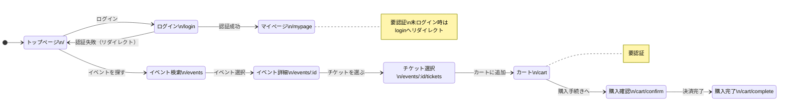
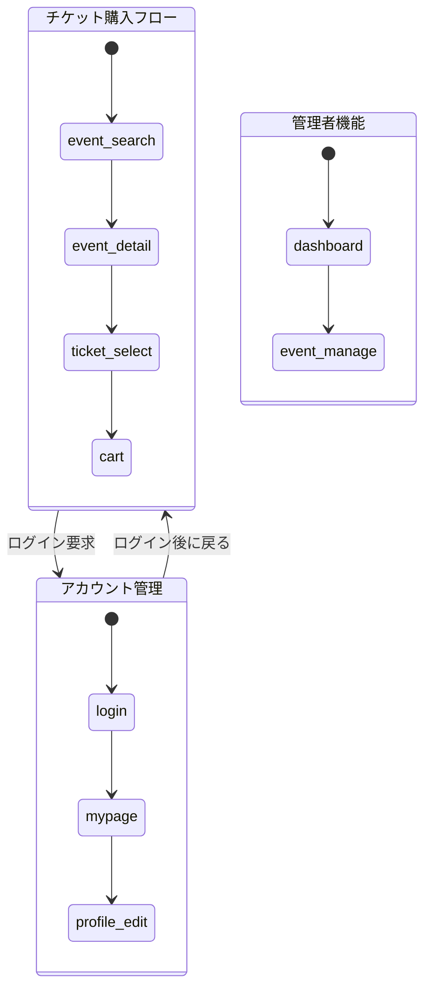

# Mermaid 画面遷移図フォーマット

## 基本構文

stateDiagram-v2 を使用する。flowchart ではなく stateDiagram を選択する理由は、画面（状態）間の遷移表現に適しているため。

## 出力テンプレート

## 命名規則

### state名
- ページパスをスネークケースに変換: `/events/[id]/tickets` → `event_id_tickets`
- 短縮可（可読性優先）: `event_detail`, `ticket_select`

### 表示名
- 日本語のページ名 + パス（改行区切り）
- 例: `"チケット選択\n/events/:id/tickets"`

## 遷移ラベル

| 種別 | ラベル例 |
|------|---------|
| ユーザー操作 | `ボタンクリック`, `フォーム送信`, `リンク選択` |
| 条件分岐 | `認証成功`, `認証失敗`, `在庫あり` |
| リダイレクト | `未認証リダイレクト`, `完了後リダイレクト` |
| 自動遷移 | `3秒後自動遷移` |

ラベルは簡潔に。長くなる場合は注釈（note）で補足する。

## 機能カテゴリ別分割時の構造

ページ数が多い場合、複合状態（composite state）でグルーピングする:

## 出力ファイル

- 単一図: `screen-transition.mermaid`
- 分割時:
  - `screen-transition-overview.mermaid`（全体概要）
  - `screen-transition-{category}.mermaid`（カテゴリ別）

ファイルは `{doc_output_dir}/` に配置する。
